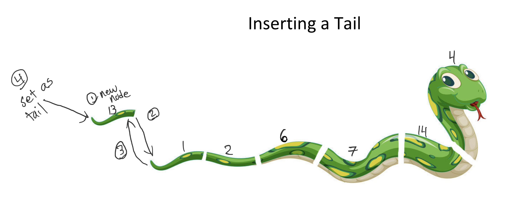
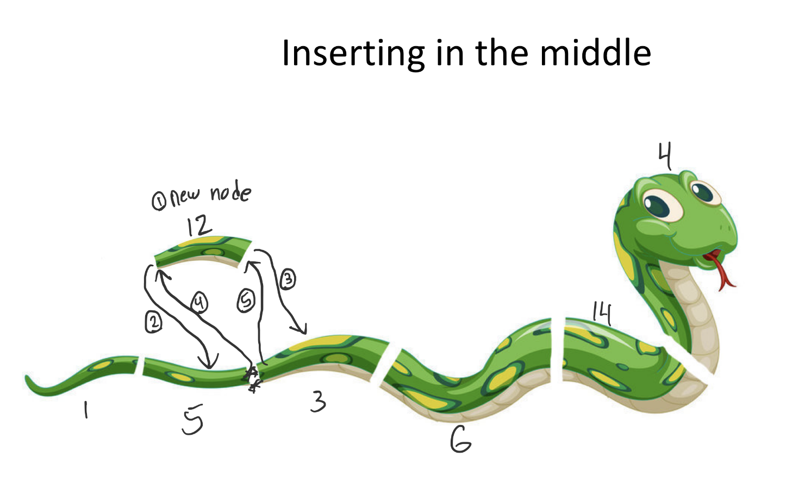

# Linked Lists
## What is a Linked list?
A linked list is different then what we had talked about before with stacks becuase everything doesn't have a set index. In a linked list each item has a certain address. Then each address is connected from one to another.

## A Snake of Linked Lists
Just like a snake a linked list has a head, a tail, and everything in between. In a linked list to access one of the middle sections you either go from the head back or the tail forward. 


## How to remove and add sections
To remove a node from the linked list there is an important process so that you dont lose the rest of the information behind the node you are replacing or removing. 

### Inserting a Node
Like a snake if you cut off the tail you lose everything behind the tail. Then the last part you cut off would be the new tail. When creating a node if you are inserting it at the beginning 
1. Create a new node
2. Set the next node as the current head
3. Set the "previous"  as the current head to the new node
4. set the head equal to the new node.


As you can see this makes it so we don't lose everything behind the head node. Then, there is a way to do this for the tail with the following steps.

1. Create a new node
2. Set the "previous" of the new node to the current tail
3. Set the "next" of the current tail to the new node
4. set the tail equal to the new node.


Then to insert in any location you can use the following steps.
1. Create a new node
2. Set the "previous" of the new node to the current node.
3. Set the "next" of the new node to the next node after the current node. 
4. set set the previous and the next node after the current to the new node.
5. set the next of the current node to the new node



### Removing a Node
Removing a node is easier then inserting a node, but it's still important to do it correctly so that you don't lose all the information behind the node you are removing. 

To remove the head node here are the steps:
1. Set the previous of the second node to nothing.
2. Set the head to the second node. 

To remove the tail node here are the following steps:
1. Set the next of the second to last node to nothing.
2. Set the tail to be the second to the last node.

To remove any node in between here are the steps:
1. Set the previous of the node after current ro the node before current.
2. Set the next of the node before teh current to the node after current.

## Performance
The [performance](performance.md) can vary depending on what you are doing. Here is a list of the different actions and the performance of them

- Inserting the head: this is a performance of O(1)
- Inserting the tail: this is a performace of O(1)
- Inserting in the middle: This is a performace of O(n) because you have to cycle throught he nodes until you find the node you are inserting after.
- Removing the head: this is a performace of O(1)
- Removing the tail: this is a performance of O(1)
- Removing in the middle: this is a performance of O(n) because you havr to cycle throught the nodes to find the node you are removing. 

## Example: Finding a value

One of the problems with linked lists is that they have a fairly low performance when searching for a value. In the example below this is how you could search for a given value in the linked list. If the the value is not in the list or its the last item it will take longer.
```py
def finding_values(self, value):
    # This sets the current node as the tail of the list
    current_node = self.tail
    # This loops until the current node is equal to the value
    while current != value:
        # You can then do any action through each loop
        print(current.data)
        # This will set the current node as the node 
        # previous to the node you were at previously
        current = current.previous
```
## Sample Problem: Song Queue
In this sample problem you will be creating a Song queue. In this code you will write code so that you can move a song from one part of the queue to another part of the queue. The functions that queue and remove songs from the queue have already been written for you in the following code [Sample Problem](Python_Files/Given_code2.py).

After trying to solve this problem for half an hour or solving the problem you can look at the [Sample Solution](Python_Files/Sample_answer2.py).