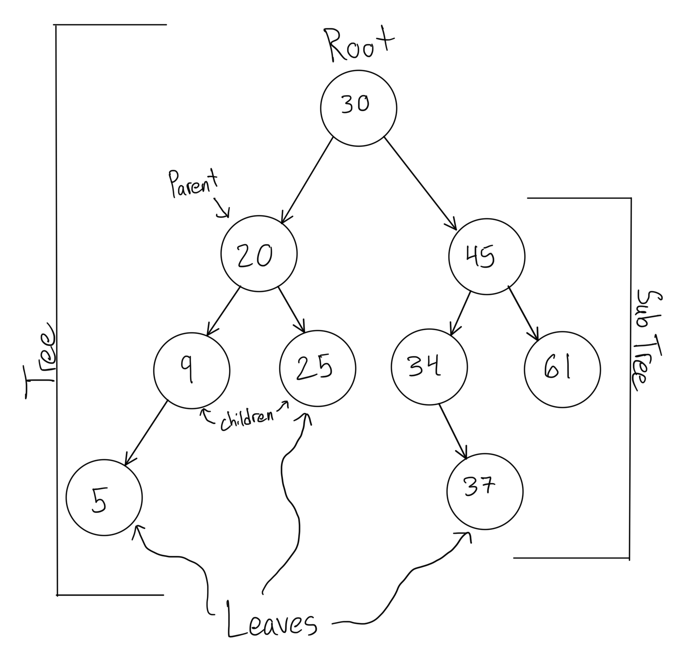
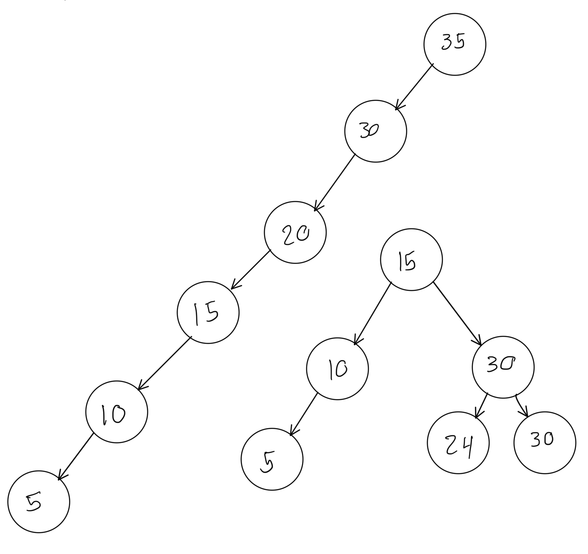

# Trees
## What is a Tree?
To understand what a Binary search tree is we have to understand what a tree is in code. Like a normal tree there are branches, roots, and even leaves.

## Understanding Recurssion
It is necessary to understand what recurssion is and how to use it before working with Trees. Recurssion refers to something that recurs over and over until we tell it to stop. While this may sound like a loop, it isn't. The difference is that in recurssion a function will call itself. This will happen over and over unless we have a set of conditions in the function to stop it.

The first condition you will need is called a base case. A base case is the condition that is going to stop the function from calling itself. Every recurssion function needs a base case or it will break from looping to many times. 

The second condition needs to be something that gets `smaller and smaller` until it reaches the base case. 

Here is a quick example of recurssion:
```python
def example_recurssion(product, counter):
    if counter == 0: # base case
        print(product)
        return
    product *= 2
    return example_recurssion(product, counter - 1) 
    # recursive statement

example_recurssion(2, 10) # 2048

```
As you can see the base case is zero. The counter gets smaller and smaller after every recurssion of the function until it reaches zero.

## Binary Search Trees
 The most common type of tree is a binary search tree. The best way to understand a binary search tree is to look at a picture of one. 
 
 As you can see below the root is the starting point of any tree in code. After this it will split off into two different values. Whenever a node splits off, this is called the parent node, and the two that split off are the child nodes. Then all the nodes that don't split off are the leaves of the tree. The tree is all the nodes together. Each tree has a subtree which is like a tree within a tree.



### How they work
So each tree starts off with a root that will branch off. so you start by creating the root node. then you compare the value of the next node with the root node. if its larger then the root node it will branch off to the right. Then you do the same thing and if the new node is smaller then the root node it branches off to the left. 

Now that the root has two branches when you add another node it will compare it to the root node, if its bigger then it will go to the number that branched off to the right. Then you compare the new node with that node, if its smaller it branches off from that node. This can be seen in the image above with the value 34. its larger then 30 but smaller then 45. Then we also added 37 which is larger then 30, smaller then 45, but larger then 34. 

### Balanced Search Trees
When using a binary search tree it is important to make it balanced. If you keep adding values that are smaller then the previous value then you will get a line of nodes tha looks like a linked list. This would defeat the purpose of using a binary search tree because it takes away from the performance. 

As you can see in the image below there is non balanced search tree on the left and a balanced one on the right. As you can see it takes 5 steps to get to the last value in the tree for the unbalanced tree. Then for the balanced tree it only takes 2 steps. It all depends on the order you are storing the data.



## Performance
The main reason trees are used is for their ability to sort things out fairly easily. For the majority of the actions done with trees the [performance](Performance.md) is log(n) because of their ability to cut the everyhting in half. 
- insert(value): log(n)
- remove(value): log(n)
- contains(value): log(n)
- height(node): log(n) (height refers to how many nodes down the tree goes)

## Example: Finding the Lowest and Highest Values
As you can see in the example below these two functions will loop through each node and checks if there is a node to the left. if there is not a node to the left then it knows that the current node is the lowest value. The same thing for the largest value but for the right. 
```python
def get_lowest_value(self):
    current = self
    if current.left == None:
        return current.data
    elif current.left != None:
        return self.get_lowest_value(current.left)

def get_highest_value(self):
    current = self
    if current.right == None:
        return current.data
    elif current.right != None:
        return self.get_highest_value(current.right)
```
## Sample Problem
For the sample problem you will creating a method in a tree class that enables you to delete a node from the tree. TO make this easier we are only deleting nodes that have 1 or 2 child nodes. We will give you the class and several other methods to add in nodes so you can test your code. Here is the [given code](Python_Files/Given_code3.py).

Once you have completed the problem or have tried for at least an hour here is the [sample solution](Python_Files/Sample_answer3.py).