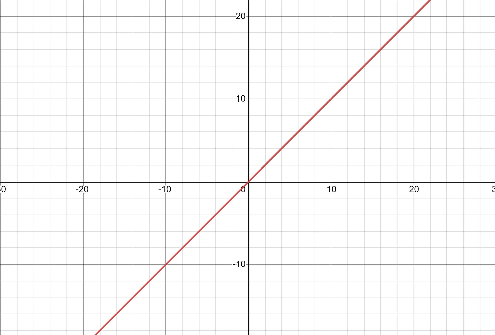
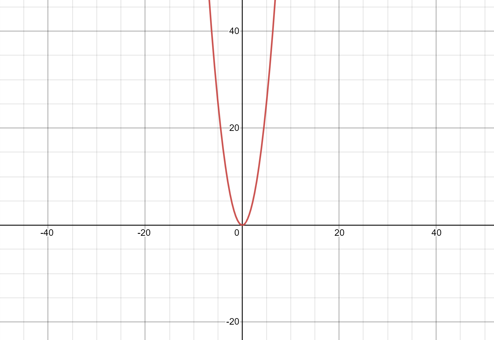
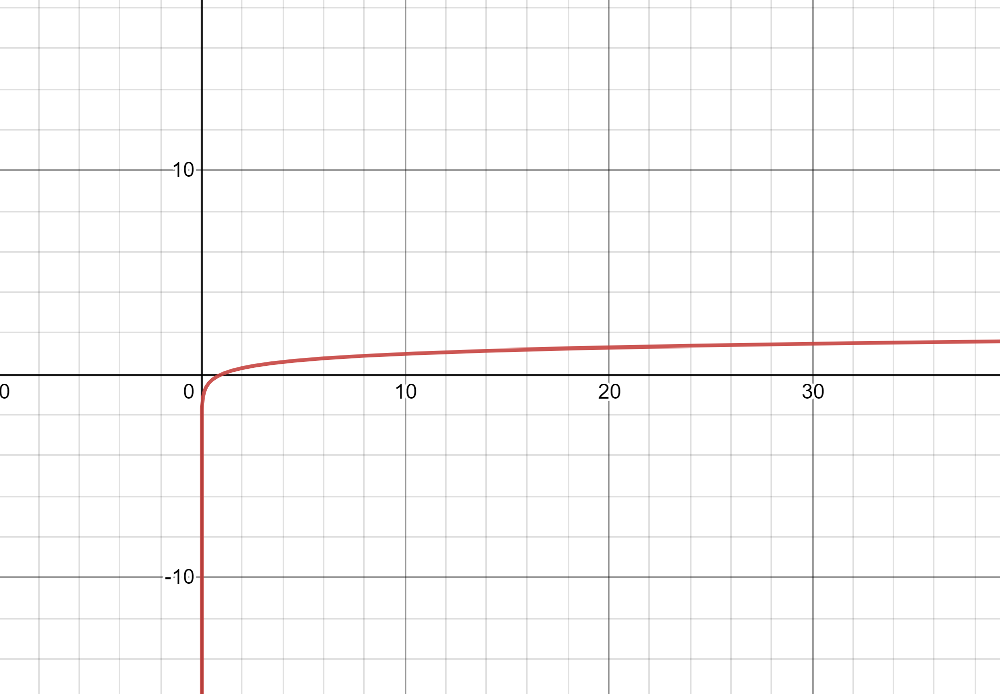

# Performance
## What is Big O-Notation?
Big O-Notation is one of the most important parts of programming anything. Big O-Notation is so important becuase it measures the performance of your code. The faster your code runs the better. 

### A Simple Example:
```python
def add():
    x = 3 # O(1)
    y = 10 # O(1)
    sum = x + Y # O(1)
    print(sum) # O(1)
```
As you can see above each line of code that executes a simple command happens in O of 1 time or O(1). This is the fastest timing for any line of code because the computer executes it then its done. if you had a long line of these O(1) commands the total performance would be considered O(1) because of how fast the computer can compute these functions. 

### A Step Worse: O(n) Performance
While it is very simple to understand that each line of code is only O(1) things begin to get more complicated as we move on. To understand what O(n) is we are going to look at another example.
```python
def loopity_loop():
    values = [1, 4, 5, 7, 8, 3, 9, 10, 14, 16] # O(1)
    for value in values: # O(n)
        print(value) 
```
as you can see loops are what create an O(n) performance. While O(1) is always gonna be better, O(n) is pretty good. Loops create O(n) performace because you never know how many times you are going to have to loop through it. Imagine having a list containing 1 million values. This would mean it the loop would print 1 million values. It all depends on what n is in O(n). This is a linear performance as seen below.




### Oh no, please no: O(n^2) Performance
This is the worst kind of performance that you do not want to accidentaly create when writiing code. This type of codes performance is exponentially worse the more data you have. To understand this lets look at another example. 
```python
def lets_make_our_computer_explode(n):
    for value in range(n): 
        for number in range(n): # O(n^2)
            print(number)
```
As you can see when you have a loop within a loop with an given number of values you create an O(n^2) performance. Basically for every number its going to count in the first loop, its going to loop through every number again. This makes the performance of anything absolutely terrible. So try to avoid this. 



### Ah much better: log(n)
The second best type of peformance is going to be the log(n) performance because of its ability to cut the calculations in half every time.

So lets say you are looking for a number between 1 and 100. you first ask if its greate or less then 50 (the halfway point). if its greater it will eliminate the numbers 1-50. it will keep doing this until it finds the number. This is much better then just looping throuhg every single posibility.


